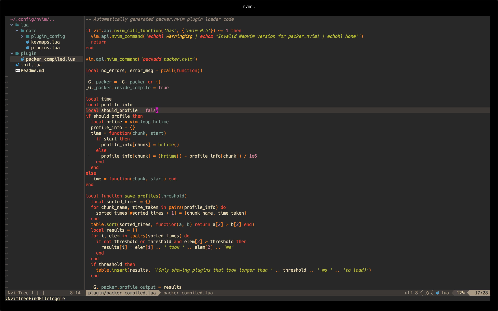

# Neo Vim Plugins & Setup (Mac OS)

Here lua language is being used to configure the settings of the neo vim terminal.

</img>

## Installation

```sh
brew install neovim
```

## Setting theme

```sh
git clone https://github.com/ocdbytes/Neovim_Lua.git

rm -rf ~/.config/nvim

mkdir -p ~/.config/nvim

cd Neovim_Lua

cp -a . ~/.config/nvim/
```

## Shortcuts

```sh
toggle folder tree : ctrl + n
telescope : ctrl + p
```
